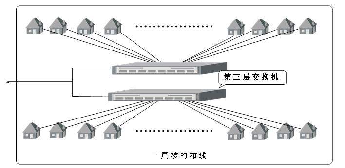

# 
计算机网络课程设计报告

 
 
 
##  
 南京林业大学 
  

##  
 学生公寓组网设计 
 

学 院：信息科学技术学院

班  级： 1752603

 

学  号： 175260221
           

姓  名：    王林炜    
            

实验课程：网络课程设计
  

试验名称：学生公寓组网方案设计
    

指导教师：汪力
       

### 

摘要：

根据实验任务和需求分析，在现有配置的情况上进行了这次学生公寓组网方案的设计，设计步骤严格按照设计要求逐步进行。设计报告中提出了网络组网拓扑布线方案和IP地址分配与子网划分方案。网络组网拓扑考虑到网络的安全性和稳定性等设计原则进行仔细的分析和设计，最后提出可行性的方案；IP地址分配与子网划分方案考虑多方面因素，包括后续可拓展性，网络地址的利用率等方面进行仔细的考虑和方案的提出，设计中详细的提出两种地址分配方案并对其详细分析和比较，并根据我校现有条件进行择优选择，选择出较合理较优越的方案。最后给出了这个设计的评价分析。

## 
目录

摘要：                    
			 
1

一、设计任务和目的         
		            
2

二、需求分析	             
	               
3

三、设计原则		     
	               
3

四、网络拓扑设计方案	  
	                    
4

1.建筑情况		       
	                 
4

2.网络拓扑布线初步规划	  
	                    
5

3.网络拓扑布线方案	    
	             
8

4.网络拓扑硬件配置	    
	             
8

5.IP地址分配与子网划分方案	  
	                   
8

 方案一：	               
	                 
10

 方案二：	               
	                 
12

6、IP地址分配与子网划分方案分析    
	         
12

五、	设计评价与分析		 
	             
12

1.学生公寓网络的高性能	 	
	            
12

2.学生公寓网络的可用性和可靠性     
	         
13

3.学生公寓网络的安全性和易管理性   
                 
13
		

4.学生公寓网络的后续可扩展性	      
	          
13

六、	设计总结	            
	       
14

七、	参考文献	            
	       
14

### 
一、	设计任务和目的
 

题目：设计学生公寓组网方案。

目的：

1.加深对计算机网络的工作原理的理解

通过编写计算机程序模拟网络通信的某些功能，使学生理解并掌握网络通信系统的基本工作原理及工作过程。

2.提高网络应用的能力

能对小型的网络应用系统进行分析，并能提出建网解决方案。

任务：

1.按照网络设计要求，写出设计方案；

2.画出网络拓扑结构图；

### 
二、	需求分析 

1.核心交换设备要求具有强大的处理能力和良好的安全性、可靠性、可扩展性;支持各种成熟技术，未来能平滑升级到万兆。

2.接入层网络设备需要支持基于MAC地址802.1x功能和基于端口802.1x功能，以此保证账号的惟一性.同时，支持远程Te1net管理、mib-||及远程开关交换机端口功能;此外还要求适应大量用户并发认证及复杂的工作环境等。

3.要求能够实现对用户名、IP地址、MAC地址、交换机端口、交换机IP的同时绑定，以此杜绝非法用户恶意盗用合法用户的用户名、密码、IP和MAC等现象，确保计费工作。

4.解决用户私自架设代理服务器的现象。

5.支持标准Radius认证计费，可连接多种接入设备。一方面要求设备支持802.1x认证方式;另一方面又要求系统支持基于时长、流量以及包月的计费模式，从而为网络管理提供完善、灵活、可定制的计费策略;同时还需要保证30，000个以上用户并行时网络运营的稳定和管理简便。

6.网络必须具备高可靠、易管理等特征。

### 
三、	设计原则

	学生宿舍网既有一般网络设计的特点，又有其特殊性，除了一般网络所必需的可靠性、稳定性和安全性等条件外，在进行学生宿舍网建设规划时，还应该考虑所有信息点的可控性、高性能以及关键业务的QoS保证等。另外在网络设计中，如何预留扩展空间和进行投资保护，以满足新应用的需求以及信息量增长和变化需要，也是学生宿舍网建设过程中需要重点考虑的因素。

在充分考虑学生宿舍网的多应用、易管理的同时，本方案同时还遵循如下原则:

1.高性能

	构建宿舍网的组网技术必须是高带宽的组网技术。骨干交换设备必须支持线速交换，以保证无阻塞的数据交换;另外，从网络结构设计上，需要考虑到一些高流量多媒体应用的分布式部署，以降低跨骨干网的流量，提高网络的性能。

2.关键业务服务质量保证

	宿舍网中有各种各样的应用业务数据流，当网络流量处于高峰期时，必定会影响关键业务数据流的响应时间，对于多媒体业务来说就会有说话结巴、图像马赛克的情况。因此，高性能的网络也还是需要QoS服务质量保证的。

3.信息点可控性

	宿舍网的信息点分布很广，与一般企业网比较，宿舍网用户的流动性大，比较难管理，为了保证网络资料的有效利用，对信息点的可控性要求是必须的。除了对访问带宽限制，还必须提供基于用户的接入认证、授权和计费。为了不影响网络性能，应该在接入层设备分布式实现信息点的控制。

4.先进性

	所选的设备必须具有很好的扩展性，当网络规模或带宽需要扩展时，能够以最小的代价满足新的需求。

5.可靠稳定性

	可靠稳定的网络平台是应用业务系统得以实施和推广的基石。网络平台的设计必须从设备、网络拓扑结构、网络技术等几个方面保证网络的可靠稳定性。

6.安全性

	宿舍网网络平台的安全，除了要保障网络平台的安全性，还需要在一定程度上保障应用业务系统和其它网络资源的安全。网络平台应该从几个方面保证网络安全:

	(1)设备本身的访问安全;

	(2)内部网之间资源访问安全;

	(3)路由系统的安全;

	(4)互联网访问安全。

### 
四、	网络拓扑设计方案

1.	建筑情况 

（1）抽出南京林业大学的8幢学生公寓进行组网设计，分别编号为1到8号楼。其中8栋楼均为六层，每层有30个房间。总共有1440个房间。

（2）学生宿舍每个房间设置1个信息点。

2.	网络拓扑布线初步规划

（1）针对用户需求，我们采用了千兆骨干、百兆到桌面，整个网络采用分布式三层交换构架，具有超高的带宽和良好的可扩展、可管理性。

（2）每个学生公寓设置一台核心交换机（第二层交换机），每楼层设置两台交换机（第三层交换机），网络主干线从网络管理中心拉出，分别到达每个学生公寓的核心交换机，每楼层的交换机直接和本楼的核心交换机相连，满足基本的建网需求。

（3）网络规划的总体拓扑图如下：

3.	网络拓扑布线方案

（1）由网络中心到各个宿舍楼之间的布线情况如下：

	假设南京林业大学已有8栋学生公寓楼，所有校内用户要连接外部internet都需经由网络管理中心，这样由网络管理中心布线到学生公寓就需要至少九个端口的交换机进行连接。我们这个选用两个16口的100/1000MB的自适应交换机实现从网络管理中心到各个学生公寓的网络连接。这样就可以满足提供8栋楼的连接，每台交换机还余下7口可用于以后的拓展（这是必须的）。

其拓扑结构如下图所示：

	这样布线目的就是避免第一级交换机一旦出现问题无法继续工作，同级的另一个第一级交换机可以确保网络不致中断，可以使整个网络继续正常运转。所以这样用两台第一级交换机布线比只用一台第一级交换机更具有可靠性和稳定性，并且也相应的减小了第一级交换机工作的负担，能够充分利用网络资源。使整个网络发挥它的最大功效。

（2）一号楼的具体布线情况如下：

	本楼有六层，利用一个8口10/100MB的自适应交换机（第二级交换机）就能够满足本楼的需求。楼内各层有30个房间，也就需要至少30个接入点，所以一个交换机不够，需要两个交换机（第三极交换机）。

（3）余下7栋楼结构大同小异，所以我们采用相同的布线结构，这样便于统一管理。

其拓扑结构如下图所示：

 （4）在每一栋学生公寓里每个楼层内按30个宿舍算起，因此我们每层用 2 个16口的10/100MB自适应交换机就能满足现在的需求，但为了方便以后网络的拓展应用，提高网络的可扩展行，我们选用一个16口的10/100MB的自适应交换机和一个24口的10/100MB的自适应交换机进行网络的连接拓展，这样就总共有38个口可以利用，现在需要用到30个，余下8口方便以后的拓展。这样，一栋楼就余下了48个口方便其他使用。

其拓扑结构如下图所示：

picture/4.jpg

4.	网络拓扑硬件配置

第一级交换机：网络拓扑中第一级交换机选用锐捷网络自主研发的万兆核心交换机RG-S6806。

第二级交换机：在楼栋接入的第二级交换机我们选用锐捷网络的STAR-S3550系列三层交换机。

第三级交换机：第三极交换机我们选用锐捷网络的支持802.1x的千兆智能交换机RG-S2126G/2150G。

安全计费：方案选用基于802.1x技术的SAM系统结合接入层S2126G/S2150G交换机对学生接入控制进行管理。

网络管理：为了对整个网络的设备进行管理，建议配置STAR View网管系统。

5.	IP地址分配与子网划分方案

抽取学校中的学生公寓8栋, 每栋公寓六层，每层有30个房间，共有房间4320间。在此基础上,进行地址划分。

方案一：

为了保证扩展性和安全性,对每栋楼的每层划分一个子网,为节省地址资源,选择每层楼地址连续,进行详细的子网划分.保证每个宿舍接入一个信息点,剩余地址资源留做扩展用途。

具体的地址分配方案和子网划分方案如下:

1号公寓：	192.168.0.0——192.168.0.255	子网掩码为255.255.255.0

其中各层楼可均分这256个地址所以各楼层地址分配如下：

一楼：		192.168.0.0——192.168.0.39

二楼：		192.168.0.40——192.168.0.79

三楼：		192.168.0.80——192.168.0.119

四楼：		192.168.0.120——192.168.0.159

五楼：		192.168.0.160——192.168.0.199

六楼：		192.168.0.200——192.168.0.239

这样还余下16个地址没有分配，可以再急需的时候利用。

2号公寓：	192.168.1.0——192.168.1.255	子网掩码为255.255.255.0

一楼：		192.168.1.0——192.168.1.39

二楼：		192.168.1.40——192.168.1.79

三楼：		192.168.1.80——192.168.1.119

四楼：		192.168.1.120——192.168.1.159

五楼：		192.168.1.160——192.168.1.199

六楼：		192.168.1.200——192.168.1.239

3号公寓：	192.168.2.0——192.168.2.255	子网掩码为255.255.255.0

一楼：		192.168.2.0——192.168.2.39

二楼：		192.168.2.40——192.168.2.79

三楼：		192.168.2.80——192.168.2.119

四楼：		192.168.2.120——192.168.2.159

五楼：		192.168.2.160——192.168.2.199

六楼：		192.168.2.200——192.168.2.239

4号公寓：	192.168.3.0——192.168.3.255	子网掩码为255.255.255.0

一楼：		192.168.3.0——192.168.3.39

二楼：		192.168.3.40——192.168.3.79

三楼：		192.168.3.80——192.168.3.119

四楼：		192.168.3.120——192.168.3.159

五楼：		192.168.3.160——192.168.3.199

六楼：		192.168.3.200——192.168.3.239

5号公寓：	192.168.4.0——192.168.4.255	子网掩码为255.255.255.0

一楼：		192.168.4.0——192.168.4.39

二楼：		192.168.4.40——192.168.4.79

三楼：		192.168.4.80——192.168.4.119

四楼：		192.168.4.120——192.168.4.159

五楼：		192.168.4.160——192.168.4.199

六楼：		192.168.4.200——192.168.4.239

6号公寓：	192.168.5.0——192.168.5.255	子网掩码为255.255.255.0

一楼：		192.168.5.0——192.168.5.39

二楼：		192.168.5.40——192.168.5.79

三楼：		192.168.5.80——192.168.5.119

四楼：		192.168.5.120——192.168.5.159

五楼：		192.168.5.160——192.168.5.199

六楼：		192.168.5.200——192.168.5.239

7号公寓：	192.168.6.0——192.168.6.255	子网掩码为255.255.255.0

一楼：		192.168.6.0——192.168.6.39

二楼：		192.168.6.40——192.168.6.79

三楼：		192.168.6.80——192.168.6.119

四楼：		192.168.6.120——192.168.6.159

五楼：		192.168.6.160——192.168.6.199

六楼：		192.168.6.200——192.168.6.239

8号公寓：	192.168.7.0——192.168.7.255	子网掩码为255.255.255.0

一楼：		192.168.7.0——192.168.7.39

二楼：		192.168.7.40——192.168.7.79

三楼：		192.168.7.80——192.168.7.119

四楼：		192.168.7.120——192.168.7.159

五楼：		192.168.7.160——192.168.7.199

六楼：		192.168.7.200——192.168.7.239

方案二：

为节省地址资源,而且方便管理，选择更小的网络对每层地址进行地址分配，保证每个宿舍接入一个信息点,剩余地址资源留做扩展用途。

具体的地址分配方案和子网划分方案如下:

1号公寓：

划分六个小子网，每个子网的主机数可达到32个，所以主机数用地址的后五位表示即可，所以子网掩码为255.255.255.224

一楼：192.168.0.0——192.168.0.31		

二楼：192.168.0.32——192.168.0.63		

三楼：192.168.0.64——192.168.0.95		

四楼：192.168.0.96——192.168.0.127	

五楼：192.168.0.128——192.168.0.159	

六楼：192.168.0.160——192.168.0.191	

这样总共分配给1号公寓192个地址，仅有12个未被利用。

2号公寓：		子网掩码为255.255.255.224

一楼：192.168.0.192——192.168.0.223		

二楼：192.168.0.224——192.168.0.255		

三楼：192.168.1.0——192.168.1.31		

四楼：192.168.1.32——192.168.1.63	

五楼：192.168.1.64——192.168.1.95	

六楼：192.168.1.96——192.168.1.127	

3号公寓：		子网掩码为255.255.255.224

一楼：192.168.1.128——192.168.1.159		

二楼：192.168.1.160——192.168.1.191		

三楼：192.168.1.192——192.168.1.223		

四楼：192.168.1.224——192.168.1.255	

五楼：192.168.2.0——192.168.2.31	

六楼：192.168.2.32——192.168.2.63	

4号公寓：		子网掩码为255.255.255.224

一楼：192.168.2.64——192.168.2.95		

二楼：192.168.2.96——192.168.2.127		

三楼：192.168.2.128——192.168.2.159		

四楼：192.168.2.160——192.168.2.191	

五楼：192.168.2.192——192.168.2.223	

六楼：192.168.2.224——192.168.2.255	

5号公寓：		子网掩码为255.255.255.224

一楼：192.168.3.0——192.168.3.31		

二楼：192.168.3.32——192.168.3.63	
	

三楼：192.168.3.64——192.168.3.95		

四楼：192.168.3.96——192.168.3.127	

五楼：192.168.3.128——192.168.3.159	

六楼：192.168.3.160——192.168.3.191	

6号公寓：		子网掩码为255.255.255.224

一楼：192.168.3.192——192.168.3.223	
	

二楼：192.168.3.224——192.168.3.255	
	

三楼：192.168.4.0——192.168.4.31		

四楼：192.168.4.32——192.168.4.63	

五楼：192.168.4.64——192.168.4.95	

六楼：192.168.4.96——192.168.4.127	

7号公寓：		子网掩码为255.255.255.224

一楼：192.168.4.128——192.168.4.159		

二楼：192.168.4.160——192.168.4.191		

三楼：192.168.4.192——192.168.4.223		

四楼：192.168.4.224——192.168.4.255	

五楼：192.168.5.0——192.168.5.31	

六楼：192.168.5.32——192.168.5.63	

8号公寓：		子网掩码为255.255.255.224

一楼：192.168.5.64——192.168.5.95
		

二楼：192.168.5.96——192.168.5.127	
	

三楼：192.168.5.128——192.168.5.159	
	

四楼：192.168.5.160——192.168.5.191	

五楼：192.168.5.192——192.168.5.223	

六楼：192.168.5.224——192.168.5.255	

6.	IP地址分配与子网划分方案分析

	方案一所用的地址段为192.168.0.0——192.168.7.255，子网掩码为255.255.255.0。按每栋楼划分一个子网的方法，8栋楼共分配了8个子网，子网号利用地址的前3个字节，用后8位表示子网的主机，一个楼层内包含的256个地址每个楼层分配40个地址。可利用地址数目为2048个，实际利用的地址数目为1440个，尚未利用的地址数目为608个，地址利用率约为70％。

	方案二所用的地址段为192.168.0.0——192.168.5.255，子网掩码为255.255.255.224。按每楼层划分一个子网，每层楼里拥有六个小子网，8栋楼里共包含了48个小子网。子网号利用地址的前27位表示，地址的后五位表示小子网内的主机。这样可以利用的地址数目为1536，实际利用的地址数目为1440个，尚未利用的地址数目只有96个，地址利用率高达94％。

	方案一的地址段较方案二宽，可利用的网络地址较多，所以可拓展性较方案二强。并且子网络地址在各个楼层分布较为均匀，这样就使每个楼栋的可拓展性得到相应的提高，不存在不可拓展网络的问题。方案二虽然拓展性不高，但其突出优点就是地址利用率非常高，这适合在网络地址数目有限并且不能在划分子网的情况。而且方案二的小子网分布在各个楼层，使学校的管理工作得到简化，方便了学校的管理，使可管理性的到提高，而方案一子网较大，管理不够细化。但如果只需对整栋楼进行管理，方案一还是有其优越性。

	综上，两种方案各有优缺点，可以根据具体情况择优选择。这里我们选择方案一，因为学校并不缺少地址，其拓展性较高，在学校公寓里拓展性相对要求较高，其次管理可以只针对一个楼栋，如无特别要求无需对每个楼层进行管理，这样方案一较方案二更方便，所以选择了方案一。

### 
五、	设计评价与分析

1.	学生公寓网络的高性能

	千兆主干，百兆交换到桌面：核心选用可支持万兆技术的交换平台，主干采用千兆，百兆交换到桌面，满足大容量、高速率的数据传输。

	复杂功能硬件实现:第一级的RG-S6806不仅硬件实现三层路由和交换,其他关键功能,如ACL、QoS、策略路由等复杂功能均通过硬件实现，第二级的STAR-S3550也是硬件实现三层交换、ACL以及QoS，特别是第一级交换机RG-S6806采用板卡智能分布式处理设计，用户接口模块可以独立实现路由、交换、ACL、QoS、收集用户信息等功能，这种分布式处理可以极大地提高整体处理能力。

	分布式三层交换：在第二级交换机引入第三层交换，减轻第一级交换机的压力，可有效减少广播包，并提高网络传输效率；

	超高背板保证所有数据包线速转发：本方案采用的第一级交换机、第二级交换机、第三极交换机均具有超高的交换容量和二、三层包转发率，确保所有数据线速转发。当今世界，通信和计算机技术发展日新月异。我们的方案要适应新技术发展的潮流。既要保证大学网络的先进性，同时也要兼顾技术的成熟性。一个大型网络光是能用还不够，必须优化设计才能这真正发挥网络的功能。本组网方案与学校校园网相适应，可以说是校园网的一个宿舍子网络的规划，更有利于校园网的运行和学校的管理。

2. 学生公寓网络的可用性和可靠性

	第一级交换机采用的双交换机方式可以保证这个网络的可用性和可靠性，确保在第一级交换机出现问题是不至于使整个网络停止工作。学生公寓网的建成，可以使学生方便地浏览和查询网上资源实现远程学习，通过网上学习学会信息处理能力。同时可以实现各级管理层之间的信息数据交换，实现网上息采集和处理的自动化，实现信息和设备资源的共享，实现教学资源的共享。通过校园网与Internet相连 ，安全性得到保证。

3.	学生公寓网络的安全性和易管理性

	完满解决IP地址冲突和IP地址盗用：锐捷S-Radius对用户进行认证时的IP属性校验，完全杜绝了IP地址冲突的发生，包括认证前IP不按要求设置的不予通过认证以及认证通过后更改IP地址立即剔除下线；对用户账号与IP地址绑定，为每个用户分配一个固定的IP地址，防止IP地址被他人盗用。对于安全性我们将通过对河南科技学院学生宿舍公寓的区域划分，和高层对校园网安全设备的共享来逐级实现网络的安全性。对内的安全实施包括用交换机进行VLAN的划分，在路由中创建访问控制列表，如此可对一些网络用户实行可控的安全级别。对于业务主机，例如服务器将通过用户权限的认证，实现用户与业务的隔离，避免非法用户的侵入。对重要数据库采取安全备份的机制，避免突发事件造成重要数据的丢失。支持通过防火墙对外部网络的非法访问进行过滤，防范于未然。

4.	学生公寓网络的后续可扩展性

	由于计算机通讯和多媒体应用的不断发展，网络系统必然随之不断扩大。因此，目前的网络设计必须为今后的扩充留有足够的余地，以保护用户的投资，保证用户今后三到五年的网络扩充升级能力。没有人敢说“我的网够用了”。数据网络的速度从从10M到100M、100M到1000M，到10000M，用户的数据传输需求从1K到现在的整个硬盘；网络速度在以指数级的发展，而网络需求也以指数级增长。一个成功的高校社区网络会具备很强的扩展能力，无论在支持的用户数量方面、对目前各种网络标准的支持还是在对未来新型技术、新业务的支持上都做好了充分的准备。本设计从网络拓扑布线设计到ip地址和子网划分的设计都充分考虑到后续的课拓展性。在第一级交换机，第二级交换机，第三极交换机出都留有足够的接口用于以后的拓展，在进行ip地址和子网划分的设计时也考虑到这一点，所以选择了子网划分的方案一，是后续可拓展性得到进一步的提高。

### 
六、	设计总结

	通过本次计算机网络课程设计，我更加充分的理解了课本上的知识，并能够加以扩展，从而应用于实践当中，在网络拓扑设计的过程中画出整个园区网络的拓扑图。并分别进行IP地址的规划并且进行了深入的分析和评价。

	这几天的课程设计令我受益匪浅，经过查阅收集各方面资料，一方面充实了理论基础，另一方面确定了局域网相关技术策略。针对局域网络组网技术进行深入分析研究，并整理出一个“学校学生公寓网的组建和维护”的方案。经过多天的学习和设计，学到了很多关于网络设计的基础知识，进一步了解了学校学生公寓的拓扑结构。很多平时模棱两可的知识点都认真复习并实践了。我对校园网络规划提升了认识，我意识到我们所学的东西将来都是要付诸实践的，所以一切要从实际情况出发，理论联系实际，这样才能真正发挥我们所具备的能力。比如划分IP时，不仅看现存多少主机数，还要看到以后的发展，未来可能增加的主机数，这样才能保证我们的工作成果不至于提前失效。当然，这就是从实际情况出发了。经过此次课程设计，我向我成功的目标又迈进了一步。

 

### 
七、	参考文献

[1] 谢希仁.计算机网络（第5版）[M].北京：电子工业出版社.2008年1月

[2] 陈有祺，吴功宜.计算机网络基础[M].天津：南开大学出版社.2000年10月

[3] 孙江宏.局域网组建及应用培训教程[M].北京：清华大学出版社.2002年2月

[4] 李馥娟.计算机网络实验教程[M].北京:清华大学出版社.2007年9月

[5] 百度百科组网技术[EB/OL].http://baike.baidu.com/view/3418202.htm

[6] 百度百科交换机[EB/OL].http://baike.baidu.com/view/1077.htm

[7] 百度百科路由器[EB/OL].http://baike.baidu.com/view/1360.htm

